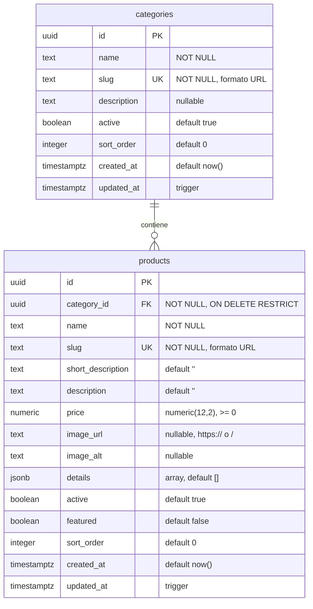

# FASE 5 — Modelo de datos del catálogo

**Estado:** diseñado y verificado localmente. **No aplicado** a ningún proyecto de Supabase (eso es Fase 6).

| Archivo | Contenido |
|---|---|
| [`SQL/migrations/20260929000100_catalog_schema.sql`](../SQL/migrations/20260929000100_catalog_schema.sql) | Tablas, constraints, índices, trigger `updated_at` |
| [`SQL/migrations/20260929000200_catalog_rls.sql`](../SQL/migrations/20260929000200_catalog_rls.sql) | Row Level Security y permisos (aplicar en Fase 6) |
| [`SQL/seed.sql`](../SQL/seed.sql) | Los 5 servicios reales (mismos datos que el mock) |
| `FrontEnd/src/database/types.ts` | Tipos TypeScript de las filas (espejo del SQL) |
| `FrontEnd/src/services/catalog.mapper.ts` | Conversión fila → DTO público (compartida por mock y Supabase) |

---

## 1. Tablas

Dos tablas. Nada más por ahora: sin carrito, pedidos, clientes, pagos, stock, reservas ni reseñas.



**Relación:** `categories 1 ──── N products`, mediante `products.category_id → categories.id`.

---

## 2. `categories`

Agrupa los productos del catálogo. Hoy: *Lecturas*. Preparada para *Velas*, *Rituales*, etc. sin cambiar el esquema: agregar una categoría es insertar una fila.

| Columna | Tipo | Nulo | Default | Qué representa |
|---|---|---|---|---|
| `id` | `uuid` | no | `gen_random_uuid()` | Identificador interno |
| `name` | `text` | no | — | Nombre visible ("Lecturas") |
| `slug` | `text` | no | — | Parte de la URL: `/catalogo/lecturas`. Único |
| `description` | `text` | sí | `null` | Texto opcional bajo el título de la categoría |
| `active` | `boolean` | no | `true` | `false` = se oculta de la web (y con ella todos sus productos) |
| `sort_order` | `integer` | no | `0` | Orden en el menú de categorías (menor = primero) |
| `created_at` | `timestamptz` | no | `now()` | Alta |
| `updated_at` | `timestamptz` | no | `now()` + trigger | Última modificación, automática |

## 3. `products`

Cada servicio o producto del catálogo (una lectura, una vela…).

| Columna | Tipo | Nulo | Default | Qué representa |
|---|---|---|---|---|
| `id` | `uuid` | no | `gen_random_uuid()` | Identificador interno |
| `category_id` | `uuid` | no | — | Categoría a la que pertenece |
| `name` | `text` | no | — | Nombre visible ("Lectura de pareja") |
| `slug` | `text` | no | — | Parte de la URL: `/catalogo/lecturas/lectura-de-pareja`. Único en todo el catálogo |
| `short_description` | `text` | no | `''` | Texto breve de la card |
| `description` | `text` | no | `''` | Descripción completa del detalle |
| `price` | `numeric(12,2)` | no | — | Precio en pesos (ARS). Exacto |
| `image_url` | `text` | sí | `null` | Referencia a la imagen (no la imagen). `null` = carta ornamental |
| `image_alt` | `text` | sí | `null` | Texto alternativo; si es `null` se usa `name` |
| `details` | `jsonb` | no | `'[]'` | "Información importante" del detalle: `[{"label":"Duración","value":"1 hora"}]` |
| `active` | `boolean` | no | `true` | `false` = se oculta de la web sin borrarlo |
| `featured` | `boolean` | no | `false` | `true` = aparece en "Lecturas destacadas" de Inicio |
| `sort_order` | `integer` | no | `0` | Orden en el catálogo (menor = primero); también define el número de carta (I, II, III…) |
| `created_at` | `timestamptz` | no | `now()` | Alta |
| `updated_at` | `timestamptz` | no | `now()` + trigger | Última modificación, automática |

**Columnas agregadas al modelo pedido, y por qué:**
- `image_alt`: accesibilidad; cada imagen necesita texto alternativo real.
- `details`: la caja "Información" del detalle (Fase 4) ya muestra estos datos. Un `jsonb` evita crear una tabla aparte o columnas fijas (duración, modalidad…) que no aplican a todos los productos (una vela no tiene "duración").

---

## 4. Constraints

| Constraint | Tabla | Regla | Por qué |
|---|---|---|---|
| `*_pkey` | ambas | `id` es clave primaria | Identidad |
| `categories_slug_key` | categories | `slug` único | Una URL = una categoría |
| `products_slug_key` | products | `slug` único (global) | Una URL = un producto; permite mover un producto de categoría sin conflictos |
| `*_slug_format` | ambas | `^[a-z0-9]+(-[a-z0-9]+)*$`, máx. 80 | **El mismo formato que valida la web** (`validation/catalog.ts`). Garantiza que todo slug guardado sea una URL válida y alcanzable |
| `*_name_check` | ambas | nombre no vacío ni solo espacios | Evita productos sin nombre |
| `products_price_check` | products | `price >= 0` | Sin precios negativos |
| `products_category_id_fkey` | products | FK a `categories.id`, `ON DELETE RESTRICT` | Ver §5.3 |
| `products_image_url_check` | products | `null`, `https://…` o `/…` | Bloquea `javascript:`, `data:` y `http:` inseguro |
| `products_details_is_array` | products | `details` es un array JSON | La web espera una lista |
| `NOT NULL` | ambas | todo excepto `description` (cat.), `image_url`, `image_alt` | Solo es opcional lo que realmente puede faltar |

**Lo que deliberadamente no se limita en la base:** largo de nombres y descripciones. Son reglas de contenido que pueden cambiar; se validan en el servidor (Zod) al guardar desde el futuro `/admin`, así se ajustan sin migrar la base.

## 5. Decisiones

### 5.1 Precio: `numeric(12,2)`
- Exacto: `float` no puede representar ciertos decimales (`0.1 + 0.2 ≠ 0.3`), inaceptable para dinero.
- 2 decimales por si en algún momento hay centavos; hoy los precios son enteros y la web los muestra sin decimales (`$5.000`). Si hubiera centavos: `$5.000,50`.
- 12 dígitos: hasta $9.999.999.999,99, más que suficiente con inflación.
- No se guarda la moneda: todo es ARS. Si algún día hubiera otra, se agrega una columna `currency`.

### 5.2 IDs: `uuid` (no `bigint`)
- **Iguales en todos los entornos:** el seed usa UUID fijos, así el mock, desarrollo y producción comparten los mismos IDs.
- **No revelan información:** un id secuencial deja adivinar cuántos productos existen o el orden de carga; un UUID no.
- **Estándar en Supabase** (`auth.users.id` también es `uuid`) y seguros de generar desde el servidor para una futura importación.
- Costo: 16 bytes vs 8 y menos legibles. Irrelevante para un catálogo de decenas de filas.
- Las URLs usan **slugs**, no IDs: el ID nunca aparece en la barra de direcciones.

### 5.3 Borrar una categoría con productos: `ON DELETE RESTRICT`
- La base **rechaza** borrar una categoría que tiene productos. Nunca se borran productos en cascada por accidente.
- Para sacar algo de la web se usa `active = false`: desaparece de inmediato (RLS lo filtra) y se puede reactivar sin perder nada.
- Desactivar una categoría oculta también sus productos, sin modificarlos.
- Si realmente hay que borrar una categoría, primero se mueven o borran sus productos a propósito.
- `ON UPDATE RESTRICT`: los UUID no cambian nunca.

### 5.4 Slug único global (no por categoría)
Pedido explícitamente y además más simple: un producto puede cambiar de categoría sin chocar con otro del mismo nombre. La URL incluye la categoría por claridad y SEO, pero el producto se identifica solo por su slug.

### 5.5 Timestamps: `timestamptz`
Guarda el instante exacto en UTC y lo convierte a la zona de quien consulta. `updated_at` lo mantiene un trigger (`set_updated_at`), así no depende de que la aplicación se acuerde de actualizarlo. La función usa `set search_path = ''` (recomendación de seguridad de Supabase para funciones).

### 5.6 Imágenes
- La tabla guarda solo la **referencia** (`image_url`), nunca el archivo.
- Fase 6+: bucket de **Supabase Storage** `product-images`, lectura pública, escritura solo desde el servidor. `image_url` guarda la URL pública `https://<proyecto>.supabase.co/storage/v1/object/public/product-images/<archivo>.webp`.
- También acepta rutas locales (`/brand/...`) para imágenes que vivan en el propio sitio.
- **¿Tabla de múltiples imágenes?** No hace falta: el diseño muestra una sola imagen por producto (la carta). Si más adelante se quiere una galería, se agrega `product_images (id, product_id FK ON DELETE CASCADE, url, alt, sort_order)` sin tocar `products`.

### 5.7 Orden y número de carta
`sort_order` define el orden; a igual valor, se ordena por nombre. El número romano de cada carta es la posición en el catálogo público ordenado (se calcula, no se guarda), así nunca queda desincronizado.

## 6. Índices

| Índice | Columnas | Para qué |
|---|---|---|
| `categories_slug_key` | `slug` (único) | Buscar categoría por URL |
| `products_slug_key` | `slug` (único) | Buscar producto por URL |
| `products_category_sort_idx` | `(category_id, sort_order)` | Índice de la FK (Postgres no lo crea solo; lo necesita el `RESTRICT`) y listado de una categoría en orden |
| `products_featured_sort_idx` | `(sort_order) WHERE active AND featured` | Destacados de Inicio |

Sin más índices: con decenas de filas cualquier otro sería costo sin beneficio.

---

## 7. Seguridad (a aplicar en Fase 6)

Definida en `20260929000200_catalog_rls.sql`.

### 7.1 Lectura pública con RLS
- RLS **activado** en ambas tablas.
- `anon` y `authenticated` solo tienen `SELECT`:
  - categorías con `active = true`;
  - productos con `active = true` **y** cuya categoría esté activa.
- **No existe ninguna política de escritura**: desde el navegador no se puede crear, modificar ni borrar nada, aunque alguien tenga la clave pública.
- Defensa en profundidad: además se revocan los permisos de escritura (`REVOKE`). Verificado: aun si por error se otorgara `UPDATE` a `anon`, RLS igual bloquea el cambio (0 filas).

### 7.2 Claves
| Clave | Dónde | Uso |
|---|---|---|
| **publishable / anon** | Variable de servidor `SUPABASE_ANON_KEY` | Lectura del catálogo (sujeta a RLS). Aunque sea "pública", la web la usa solo desde el servidor |
| **service_role / secret** | Solo servidor, `SUPABASE_SERVICE_ROLE_KEY` | Saltea RLS. Solo para operaciones de `/admin` **después** de verificar autorización. Nunca con prefijo `NEXT_PUBLIC_`, nunca en un componente de cliente |

El cliente de Supabase vivirá en un módulo con `import "server-only"`: si alguien lo importa desde el navegador, el build falla.

### 7.3 Futuro `/admin` (no implementado)
1. Login con Supabase Auth.
2. Cada Server Action de escritura verifica en el servidor que el usuario sea administrador (rol en `app_metadata`, que solo se puede asignar desde el servidor).
3. Los datos recibidos se validan con Zod (tipos, largos, precio ≥ 0, slug, URL de imagen) **antes** de tocar la base; los constraints de §4 son la última barrera.
4. Recién entonces se escribe con el cliente de servidor.

Nunca se confía en valores del formulario: ni el precio, ni el ID, ni el rol.

---

## 8. Migración del mock a Supabase (Fase 6)

```
Supabase / PostgreSQL          (tablas + RLS + seed de esta fase)
        ↓  filas CategoryRow / ProductRow  (src/database/types.ts)
catalog.supabase.ts            (nuevo: consultas parametrizadas con el query builder)
        ↓  catalog.mapper.ts   (fila → DTO, el MISMO que usa hoy el mock)
catalog.repository             (interfaz, sin cambios)
        ↓
catalog.service                (validación de slugs, sin cambios)
        ↓
UI                             (sin cambios: no conoce Supabase)
```

**Lo que ya quedó preparado en esta fase:**
- El mock guarda los datos **con la misma forma que las filas de la base** (`snake_case`, mismos UUID que el seed) y los convierte con el mismo `catalog.mapper.ts` que usará Supabase.
- El mock reproduce las reglas de RLS (solo activos, de categorías activas) y el mismo orden (`sort_order`, luego nombre).

**Pasos de la Fase 6:**
1. Crear el proyecto de Supabase y aplicar las dos migraciones y el seed.
2. Crear `src/services/catalog.supabase.ts` implementando `CatalogRepository` con `.from("products").select(...).eq("slug", slug)` (parametrizado, sin SQL armado a mano).
3. Cambiar una línea en `src/services/catalog.ts`: `mockCatalogRepository` → `supabaseCatalogRepository`.
4. Opcional: reemplazar `src/database/types.ts` por los tipos generados (`supabase gen types typescript`).
5. Conservar el mock para desarrollo y tests.

La UI, las páginas, el servicio y la validación no cambian.

---

## 9. Verificación realizada

Sin conectar Supabase: las migraciones y el seed se ejecutaron en **PGlite** (PostgreSQL real compilado a WebAssembly) con los roles `anon` y `authenticated` que trae Supabase. **35/35 pruebas OK:**

- Seed: 1 categoría, 5 productos, precios exactos `5000.00 … 18000.00`, tipo `numeric`.
- Rechazados por la base: precio negativo, precio como texto, slug duplicado, slug con mayúsculas / guion bajo / espacios / `' or 1=1--`, slug de 81 caracteres, nombre vacío, `image_url` con `javascript:` o `http:`, `details` que no es array, categoría inexistente, `category_id` o `price` nulos, slug de categoría duplicado.
- Aceptados: imagen `https://…supabase.co/storage/…` y ruta local `/brand/…`; defaults correctos.
- `DELETE` de categoría con productos → rechazado por `RESTRICT`; los 5 productos intactos.
- Trigger `updated_at` funciona.
- RLS como `anon`: ve 5 productos; producto inactivo → invisible (pero existe); categoría inactiva → ella y sus productos invisibles; `INSERT`/`UPDATE`/`DELETE` → *permission denied*; con `UPDATE` otorgado por error → RLS bloquea igual (0 filas).
- **Mock vs base de datos:** el catálogo público que devuelve el mock y el que devuelve la consulta SQL como `anon` son **idénticos** (12 campos × 5 productos).
